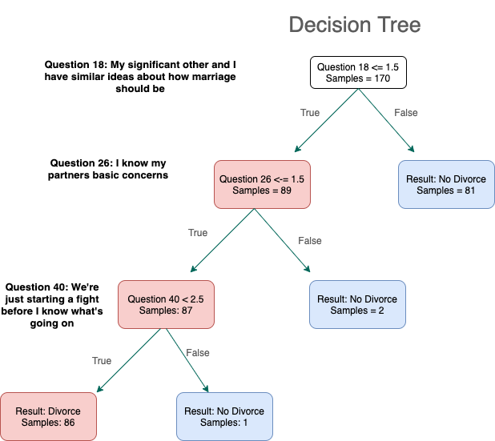

# Predicting Divorce With Machine Learning

# The Goal
Can divorce be predicted based of a 54 questonaire? In this project the goal is to cater to both consumers and data scientists. Consumers in this case are new couples entering into the world of marriage who want to discover important questions that impact how successful a marriage in. In order to satisfy fellow data scientists, the other goal in this project to create the best possible model to predict marriage sucess based on previous data.

# Background

Divorce has been increasingly common in today's society. The Center for Disease Control, [CDC](https://www.cdc.gov/) conducts a [National survery](https://www.cdc.gov/nchs/data/dvs/national-marriage-divorce-rates-00-18.pdf) anually on marriage and divorce rate trends. The latest findings reported 2,132,853 marriages and 782,038 divorces for just the year 2018. 

It turns out that Turkey is among some of the top countries with increasing divorce rates. 

# The Data
The data for this project was found [here](http://archive.ics.uci.edu/ml/datasets/Divorce+Predictors+data+set). Hosted by the UCI machine learning repository. A break down of 54 features and 170 different participants.

  

    Click this drop down menu to take a look at all questions from the survey.
  

**Import**  to note here that these questions are a direct Turkish-English translation and are quite loose in their meanings. Upon further reading, each participant in the relationship were asked these questions about their significant other, instead of just the male asked about the wife as it appears.
    <ol>
   <li> When one of our apologies apologizes when our discussions go in a bad direction, the issue does not extend.</li>
    <li> I know we can ignore our differences, even if things get hard sometimes. </li>
   <li> When we need it, we can take our discussions with my wife from the beginning and correct it. </li>
   <li> When I argue with my wife, it will eventually work for me to contact him. </li>
   <li>  The time I spent with my wife is special for us.</li>
   <li> We don’t have time at home as partners. </li>
    <li> We are like two strangers who share the same environment at home rather than family. </li>
    <li> I enjoy our holidays with my wife. </li>
    <li> I enjoy traveling with my wife. </li>
    <li> My wife and most of our goals are common. </li>
    <li> I think that one day in the future, when I look back, I see that my wife and I are in harmony with each other. </li>
    <li> My wife and I have similar values in terms of personal freedom. </li>
    <li> My husband and I have similar entertainment. </li>
    <li> Most of our goals for people (children, friends, etc.) are the same. </li>
    <li>Our dreams of living with my wife are similar and harmonious </li>
    <li> We’re compatible with my wife about what love should be </li>
    <li> We share the same views with my wife about being happy in your life </li>
    <li> My wife and I have similar ideas about how marriage should be </li>
    <li> My wife and I have similar ideas about how roles should be in marriage </li>
    <li> My wife and I have similar values in trust </li>
    <li> I know exactly what my wife likes. </li>
    <li> I know how my wife wants to be taken care of when she’s sick. </li>
    <li> I know my wife’s favorite food. </li>
    <li> I can tell you what kind of stress my wife is facing in her life. </li>
    <li> I have knowledge of my wife’s inner world. </li>
    <li> I know my wife’s basic concerns. </li>
    <li> I know what my wife’s current sources of stress are. </li>
    <li> I know my wife’s hopes and wishes. </li>
    <li> I know my wife very well. </li>
    <li> I know my wife’s friends and their social relationships. </li>
    <li> I feel aggressive when I argue with my wife. </li>
    <li> When discussing with my wife, I usually use expressions such as you always or you never. </li>
    <li> I can use negative statements about my wife’s personality during our discussions. </li>
    <li> I can use offensive expressions during our discussions. </li>
    <li> I can insult our discussions. </li>
    <li> I can be humiliating when we argue. </li>
    <li> My argument with my wife is not calm. </li>
    <li> I hate my wife’s way of bringing it up. </li>
    <li> Fights often occur suddenly. </li>
    <li> We’re just starting a fight before I know what’s going on. </li>
    <li> When I talk to my wife about something, my calm suddenly breaks. </li>
    <li> When I argue with my wife, it only snaps in and I don’t say a word. </li>
    <li> I’m mostly thirsty to calm the environment a little bit. </li>
    <li> Sometimes I think it’s good for me to leave home for a while. </li>
    <li> I’d rather stay silent than argue with my wife. </li>
    <li> Even if I’m right in the argument, I’m thirsty not to upset the other side. </li>
    <li> When I argue with my wife, I remain silent because I am afraid of not being able to control my anger. </li>
    <li> I feel right in our discussions. </li>
    <li> I have nothing to do with what I’ve been accused of. </li>
    <li> I’m not actually the one who’s guilty about what I’m accused of. </li>
    <li> I’m not the one who’s wrong about problems at home. </li>
    <li> I wouldn’t hesitate to tell her about my wife’s inadequacy. </li>
    <li> When I discuss it, I remind her of my wife’s inadequate issues. </li>
    <li> I’m not afraid to tell her about my wife’s incompetence </li>
   </ol>

.

The original  divorce prediction was carried out by using the  Divorce Predictors Scale (DPS) developed by Yöntem and İlhan (2017, 2018) on the basis of Gottman couples therapy (Gottman, 2014; Gottman and Gottman, 2012). The reason
for this is that Gottman couples therapy is a model that explains the causes of divorce based on empirical research. 

Of the participants, 84 (49%) were divorced and 86 (51%) were
married couples. There were 84 males (49%) and 86 females (51%) in the
study group. The ages of the participants ranged from 20 to 63 (X̄= 36.04).
 Although the study was collected from seven different
regions of Turkey, the data can be applied to most demographics.

Important to note that of the participants, 74 (43.5%) were married for love, and 96 (56.5%) were married in an arranged marriage

# Intital EDA

First, taking a look at the raw data yields us:

|    |   Atr1 |   Atr2 |   Atr3 |   Atr4 |   Atr5 |   Atr6 |   Atr7 |   Atr8 |   Atr9 |   Atr10 |   Atr11 |   Atr12 |   Atr13 |   Atr14 |   Atr15 |   Atr16 |   Atr17 |   Atr18 |   Atr19 |   Atr20 |   Atr21 |   Atr22 |   Atr23 |   Atr24 |   Atr25 |   Atr26 |   Atr27 |   Atr28 |   Atr29 |   Atr30 |   Atr31 |   Atr32 |   Atr33 |   Atr34 |   Atr35 |   Atr36 |   Atr37 |   Atr38 |   Atr39 |   Atr40 |   Atr41 |   Atr42 |   Atr43 |   Atr44 |   Atr45 |   Atr46 |   Atr47 |   Atr48 |   Atr49 |   Atr50 |   Atr51 |   Atr52 |   Atr53 |   Atr54 |   Class |
|---:|-------:|-------:|-------:|-------:|-------:|-------:|-------:|-------:|-------:|--------:|--------:|--------:|--------:|--------:|--------:|--------:|--------:|--------:|--------:|--------:|--------:|--------:|--------:|--------:|--------:|--------:|--------:|--------:|--------:|--------:|--------:|--------:|--------:|--------:|--------:|--------:|--------:|--------:|--------:|--------:|--------:|--------:|--------:|--------:|--------:|--------:|--------:|--------:|--------:|--------:|--------:|--------:|--------:|--------:|--------:|
|  0 |      2 |      2 |      4 |      1 |      0 |      0 |      0 |      0 |      0 |       0 |       1 |       0 |       1 |       1 |       0 |       1 |       0 |       0 |       0 |       1 |       0 |       0 |       0 |       0 |       0 |       0 |       0 |       0 |       0 |       1 |       1 |       2 |       1 |       2 |       0 |       1 |       2 |       1 |       3 |       3 |       2 |       1 |       1 |       2 |       3 |       2 |       1 |       3 |       3 |       3 |       2 |       3 |       2 |       1 |       1 |
|  1 |      4 |      4 |      4 |      4 |      4 |      0 |      0 |      4 |      4 |       4 |       4 |       3 |       4 |       0 |       4 |       4 |       4 |       4 |       3 |       2 |       1 |       1 |       0 |       2 |       2 |       1 |       2 |       0 |       1 |       1 |       0 |       4 |       2 |       3 |       0 |       2 |       3 |       4 |       2 |       4 |       2 |       2 |       3 |       4 |       2 |       2 |       2 |       3 |       4 |       4 |       4 |       4 |       2 |       2 |       1 |
|  2 |      2 |      2 |      2 |      2 |      1 |      3 |      2 |      1 |      1 |       2 |       3 |       4 |       2 |       3 |       3 |       3 |       3 |       3 |       3 |       2 |       1 |       0 |       1 |       2 |       2 |       2 |       2 |       2 |       3 |       2 |       3 |       3 |       1 |       1 |       1 |       1 |       2 |       1 |       3 |       3 |       3 |       3 |       2 |       3 |       2 |       3 |       2 |       3 |       1 |       1 |       1 |       2 |       2 |       2 |       1 |
|  3 |      3 |      2 |      3 |      2 |      3 |      3 |      3 |      3 |      3 |       3 |       4 |       3 |       3 |       4 |       3 |       3 |       3 |       3 |       3 |       4 |       1 |       1 |       1 |       1 |       2 |       1 |       1 |       1 |       1 |       3 |       2 |       3 |       2 |       2 |       1 |       1 |       3 |       3 |       4 |       4 |       2 |       2 |       3 |       2 |       3 |       2 |       2 |       3 |       3 |       3 |       3 |       2 |       2 |       2 |       1 |
|  4 |      2 |      2 |      1 |      1 |      1 |      1 |      0 |      0 |      0 |       0 |       0 |       1 |       0 |       1 |       1 |       1 |       1 |       1 |       2 |       1 |       1 |       0 |       0 |       0 |       0 |       2 |       1 |       2 |       1 |       1 |       1 |       1 |       1 |       1 |       0 |       0 |       0 |       0 |       2 |       1 |       0 |       2 |       3 |       0 |       2 |       2 |       1 |       2 |       3 |       2 |       2 |       2 |       1 |       0 |       1 |

To get a better understanding of my data I needed to first grasp how the questionaire was conducted. Participiants were provided a list of 54 statements amount marriage and asked to provide a 1-4 response of 4 = strongly agree, 3 = agree, 2 = disagree, and 1 = strongly disagree.

With this in mind I wanted to then look at a simple distribution of our output class, "Married or dviorced".

Luckily our data is evenely disributed so we won't need to worry about any class imablances here. 

# For New Couples

To address the new couples audience one of the most important things to look at from this project is based off this questionaire "What really are the most important questions for a successul mariage?". 

In order to answer this question a Principal Component Analysis was conducted on the existing data to determine which question from the survey will be most important on future surveys completed by new couples. Now, for the time being you can forget about the process behind how this was calculated as we will discuss that once we address the Data science audience. 

Based off my calculations from this survey I can tell you that the top 5 most important features in a marriage asked in this survey are the following:

| 1 | I enjoy traveling with my significant other.                               |
|---|----------------------------------------------------------------------------|
| 2 | The time I spend with my significant other is special for us.              |
| 3 | My significant other and I share the same views about being happy in life. |
| 4 | I know my significant other very well.                                     |
| 5 | My significant other and I have similar ideas about roles in marriage      |

You can see a clear relationship from the top two both dealing with spending time with a significant other. And it turns out, experts agree. According to a recent article in the Journal of marriage and family, couples were twice as happy in their life when they spent more time together. Who would of thought!

# Principal Component Analysis
In the first look at my data, it appeared that the questions all had a high level of correlation to one another. To solve this the Principal Component Analysis method was applied.

**Steps of PCA**
1) Standardize columns so mean = 0 and standard deviation = 1
2) Define number of components, then fit PCA onto new standardized data. 
3) Output new transformed data frame for later use.
4) Evaluate top 5 PCA components to determine most weighted questions

Dimensiobnaltiy reduction
1. reduce correlation and reduce dimensonality
2. Similiarties between questions 

Clear seperatability between the two groups. 

Now that we can see a clear separation between our values we can move onto a logistic regression using our new transformed data frame.

# Logistic Regression
The first model I explored for this project was [Logistic Regression](https://en.wikipedia.org/wiki/Logistic_regression#:~:text=Logistic%20regression%20is%20a%20statistical,a%20form%20of%20binary%20regression). 
The following steps outline how I conducted my logistic regression model

**Steps to Logistic Regression**
1) Define X and y.
    * X is the dataframe with the outcome column removed.
    * y is assigned to only the outcome column
2) Split data (in this case 33/67) into test and train sets for both X and y.

3) Fit the logistic regression model on the data and train model.
4) Predict X test future values.
5) Output performace of model

This logistic regression produced an **Accuracy of 98.23%**.

# Single Decsion Tree

For a second model I chose to apply a [Single Decision Tree](https://en.wikipedia.org/wiki/Decision_tree#:~:text=A%20decision%20tree%20is%20a%20flowchart%2Dlike%20structure%20in%20which,taken%20after%20computing%20all%20attributes) to my data. It's important to note here, that unlike in the logistic regression model where the PCA dataframe was used, the orginal data frame was used.

The steps taken to apply this model were very similiar to the logistic regression steps. After fiting and training the new model here are the scores of the single decision tree:

The single decision tree produced an **Accuracy of 98.24%**

# Conclusions and future expansions
In this project, I took a questionaire survey of 54 features that 170 different couples were asked to respond to. The goal was to train a model to accurately predict new incoming survey data on weather or not the couple would divorce. With both my models coming in at 98.23% and 98.24% accuracy scores this project was a success. 

In the future I would like to create a user interface by means of a flask app that allows new couples to complete the survey. Upon completion of the survey, their results would then be put through my models and a prediction would be displayed for the user. 

# Weakness of study
In this project there are weaknesses in the data and the study overall. The most immediate concern is that all the previous data was collected from couples who were already attending couples thearpy together. Another weakness that was discovered was the fact that some questions answering a "4-Strongly agree" could have completely different meanings. For example, if the participant answers strongly agree to "I enjoy traveling with my significant other" and also answers strongly agree to "I can use negative statements about my significant others personality during our discussions" the model has a difficult time distinguishing between these two outcomes. 

It's also very important to highlight the fact that 56% of the couples that participated in the survery were in an arranged marriage. 